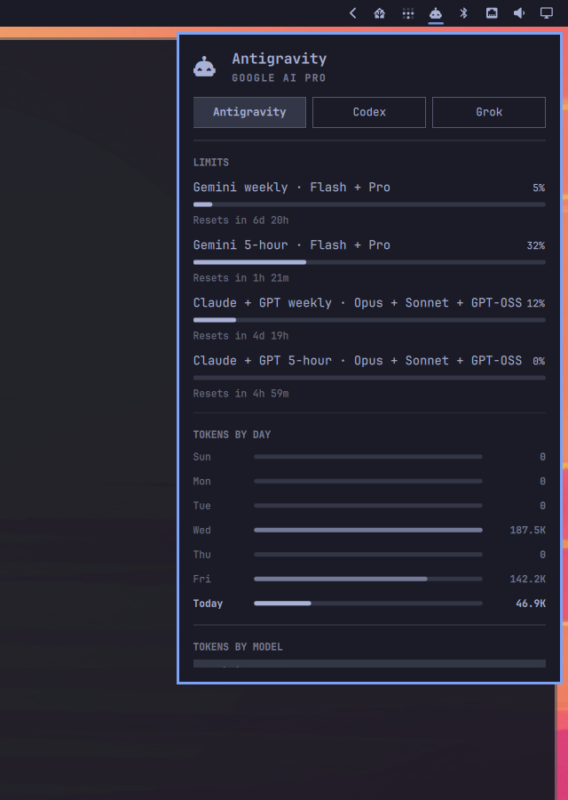

# Antigravity Usage

Adds Google Antigravity (`agy`) to Omarchy's existing AI toolbar widget. It does not add a second icon.

After install, click the AI button on the bar. An **Antigravity** chip appears next to the other agents. The hero shows the plan from the AGY console. Limits are one meter per shared quota pool. The row names the pool class that shares it, such as Flash + Pro, not every versioned model.



## Install

```sh
omarchy plugin add https://github.com/gokivego/omarchy-antigravity-usage.git --enable
```

Requires:

- Omarchy with the stock AI agent widget enabled (`omarchy.agents`, enabled by default)
- Python 3 on `PATH` (standard library only)
- Antigravity CLI (`agy`) installed and signed in
- `secret-tool` on Linux if `agy` stores OAuth in the desktop keyring (usual on Omarchy)

This plugin is a headless service (`kinds: ["service"]`). It writes a usage record to `~/.local/state/omarchy/agents/usage/antigravity.json`. The built-in `omarchy.agents` widget watches that directory and draws the Antigravity tab.

Plugins run unsandboxed inside `omarchy-shell`, with your user permissions. Read the code before you enable it.

## Usage

- Left click the existing AI icon to open the usage panel.
- Switch to **Antigravity** with the chip in the panel, or middle-click the icon.
- Press `r` or Enter in the panel to refresh. The collector also runs about every 5 minutes.

Quota rows come from `agy --print /usage`. Each group is one weekly meter and one 5-hour meter. The stock panel truncates a long title instead of wrapping, so the row names the pool class (Flash + Pro, or Sonnet + Opus + GPT-OSS) rather than every 3.8/3.7/3.6 variant. `agy models` still classifies new models into those pools. A new `/usage` group becomes a new pair of rows.

Antigravity does not publish tokens per day. `/usage` is only remaining quota. The TOKENS BY DAY chart is built from conversation transcripts: each step's `created_at` and the model selected at that step. The same walk fills TOKENS BY MODEL, so today's bar matches today's model split. Day totals are also stored in `~/.cache/omarchy/agent-usage/antigravity-daily.json` so a deleted transcript does not wipe an older day in the last 45 days.

The plan under the Antigravity name is `paidTier.name` from Cloud Code `loadCodeAssist`, the same field the AGY console shows, such as `Google AI Pro`. It is not inferred from which models you can see.

To pin the hero text instead of using the console plan, set `forceTier` in `~/.config/omarchy/agents/antigravity.json`:

```json
{
  "forceTier": "Google AI Pro"
}
```

Prompt and session counts in the Today tooltip come from `~/.gemini/antigravity-cli/history.jsonl`. Token numbers are estimates from transcript length, not official billing tokens.

## Remove

```sh
omarchy plugin remove io.github.gokivego.antigravity-usage
```

Removal uninstalls the plugin and deletes `~/.local/state/omarchy/agents/usage/antigravity.json`. The Antigravity tab leaves the stock AI panel. CLI history, settings, and sign-in are not changed.

## License

MIT. See [LICENSE](LICENSE).
